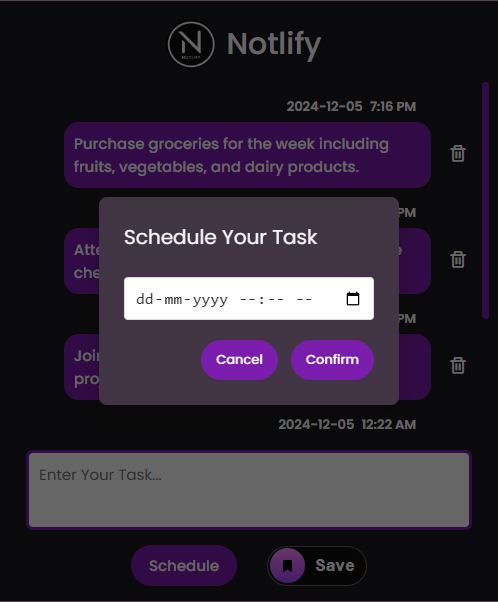

# Notlify - Chrome Extension for Smart Task Reminders

Notlify is a Chrome extension designed to help users manage their tasks efficiently. With features like scheduled notifications, persistent task storage, and a visually appealing notification modal, Notlify ensures users never miss their deadlines. It leverages Chrome's APIs for seamless performance and an intuitive user experience.

<div style="text-align: center;">
  
</div>


## Features

### 1. **Task Management**
- Add, view, and delete tasks using a clean and user-friendly interface.
- Tasks are stored in the browser's local storage, ensuring they remain accessible even after closing the browser or the extension.
- The task list updates dynamically, allowing for seamless task management.
  
**Screenshot: Task Management UI**

<div style="text-align: center;">
  
</div>

### 2. **Scheduled Notifications**
- Schedule notifications for tasks at specific times.
- Tasks cannot be scheduled before the current date and time, ensuring only valid future reminders are created.
- Receive system notifications with task details (name, time) when the reminder is triggered.
- Accurate and reliable reminders powered by Chrome's Alarm API.

**Screenshot: Notification Example**

<div style="text-align: center;">
  
  
</div>

### 3. **Custom Modal Notifications**
- When a task reminder is triggered, a custom modal appears with task details, styled for a visually appealing experience.
- If the current tab is inaccessible (e.g., `chrome://` pages), a new tab (like Google) is opened to display the modal.

**Screenshot: Modal Notification Example**
<div style="text-align: center;">
  
  
</div>

### 4. **Task Deletion and Automatic Cleanup**
- Tasks can be deleted instantly from the UI, which updates the task list and local storage in real time.
- Deleting a task also removes its scheduled notification, preventing unnecessary reminders.
- Tasks and their reminders are automatically deleted after 24 hours, keeping your task list clean and relevant.


### 5. **Real-Time Updates**
- The task list dynamically updates in real-time as tasks are added, edited, or deleted.
- Deleting a task removes its associated scheduled notification, ensuring no unnecessary alerts.


### 6. **Cross-Tab Notification System**
- Notifications are sent to the current active tab.
- If no active tab is accessible or the user is on a blank tab, the extension ensures that reminders are displayed by opening a new accessible tab.

### User-Friendly Interface
- The extension features a simple, user-friendly interface for effortless task management.
- Task details, notifications, and modals are designed for ease of use and clarity.


## Technologies Used

- **Languages & Libraries**: JavaScript, HTML, CSS
- **Chrome APIs**: 
  - Alarms API (for scheduling reminders)
  - Notifications API (for sending alerts)
  - Tabs API (for managing tabs)
  - Storage API (for persisting tasks)
- **Design**: Custom styling for the notification modal, dark mode support.


## How to Use

1. **Install the Extension**
   - Clone this repository or download the ZIP file.
   ```
   git clone https://github.com/Shaw145/Notlify.git
   ```
   - Extract the contents and load the extension in Chrome via `chrome://extensions/` in Developer Mode.

2. **Add Tasks**
   - Open the extension popup and add your task details, including the reminder time.

3. **Receive Notifications**
   - When the scheduled time arrives, receive a system notification or a modal on the current active tab.

4. **Manage Tasks**
   - View, delete, and manage your tasks directly from the extension UI.


## Screenshots

### 1. Task Management Interface
<div style="text-align: center;">
  
</div>

### 2. Chrome Notification Example
<div style="text-align: center;">
  
</div>

### 3. Modal Notification Example
<div style="text-align: center;">
  
</div>


## Future Enhancements

- **Multi-Device Notifications**: Enable sending notifications to multiple devices like phones and tablets, ensuring users never miss a task reminder even if they're away from their primary device.
- **Recurring Reminders**: Add support for creating recurring reminders (e.g., daily, weekly, monthly) to manage repetitive tasks seamlessly.
- **Enhanced UI/UX**: Improve the visual design and user experience with advanced themes and customization options.


## Author
- Suman Shaw


### Stay organized with Notlify and never miss a deadline again!
